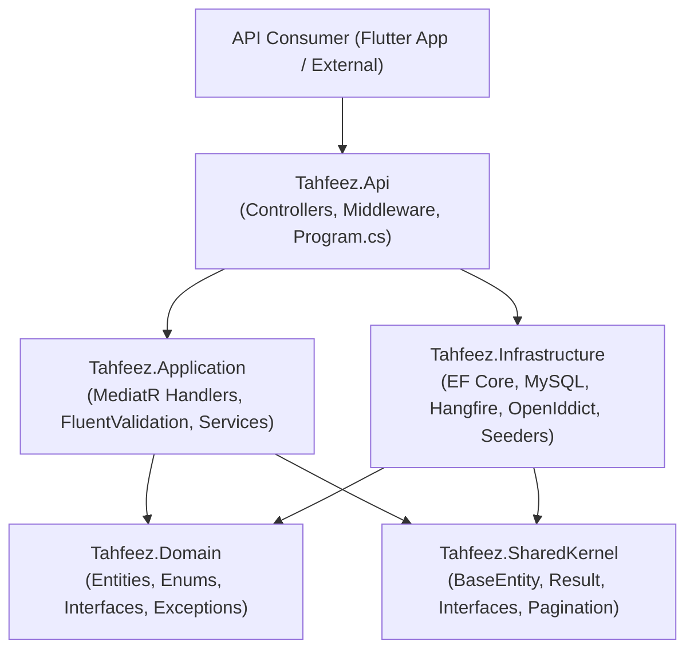
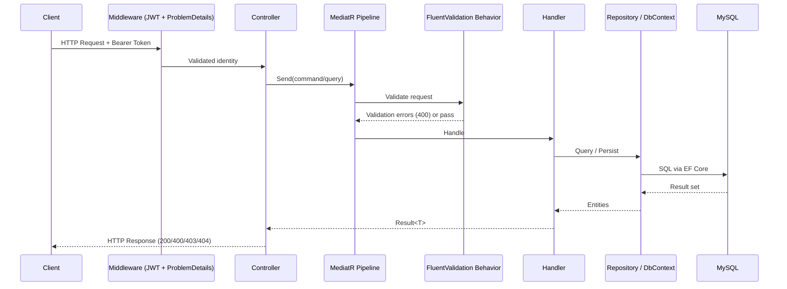

# Design Document: Tahfeez Backend

## Overview

Tahfeez is a Quran memorization management backend API built on ASP.NET Core. It serves a multi-role educational platform where Admins, Teachers, Assistants, Supervisors, Accountants, Parents, and Students interact with a shared system for class management, attendance, recitation grading, financial tracking, badge awards, competitions, educational content, messaging, and monthly assessments.

The system follows clean architecture principles with strict layer separation. All business logic lives in the Application layer (MediatR commands/queries), domain rules in the Domain layer, persistence in the Infrastructure layer, and HTTP concerns in the API layer. A SharedKernel project provides base types and interfaces shared across all layers.

Authentication is handled by OpenIddict acting as an OAuth 2.0 / OIDC server, issuing JWT access tokens and refresh tokens. All protected endpoints validate JWT bearer tokens via ASP.NET Core middleware. Authorization is role-based at the controller level and resource-level inside MediatR handlers.

---

## Architecture

### Layer Diagram



### Request Flow



### Project Structure

```
src/
  Tahfeez.Api/
    Controllers/
    Middleware/
    Helpers/
    Extensions/
    Program.cs
  Tahfeez.Application/
    Behaviors/
      ValidationBehavior.cs
      LoggingBehavior.cs
    Features/
      Auth/
      User/
      Class/
      Student/
      Attendance/
      Recitation/
      Subscription/
      Salary/
      Badge/
      Competition/
      EducationalContent/
      Message/
      MonthlyQuestion/
      GradeBookSettings/
    Services/
    Utilities/
  Tahfeez.Domain/
    Entities/
    Enums/
    Exceptions/
    Repositories/
  Tahfeez.Infrastructure/
    Persistence/
      TahfeezDbContext.cs
    Configurations/
    Interceptors/
      AuditInterceptor.cs
    Seeders/
      RoleSeeder.cs
      AdminSeeder.cs
    Repositories/
    BackgroundJobs/
      BadgeCalculationJob.cs
    Services/
    UnitOfWork/
  Tahfeez.SharedKernel/
    Common/
      BaseEntity.cs
      AuditableEntity.cs
    Constants/
    Interfaces/
      ISoftDeletable.cs
      IFullAudit.cs
    Pagination/
      PagedResult.cs
test/
  Tahfeez.Api.Test/
  Tahfeez.Application.Test/
```

### Key Technology Decisions

| Concern | Choice | Rationale |
|---|---|---|
| Web framework | ASP.NET Core 8 | LTS, mature ecosystem, strong DI |
| ORM | EF Core 8 + Pomelo MySQL | Fluent migrations, LINQ queries, soft-delete filters |
| Auth server | OpenIddict | Embedded OAuth/OIDC, no external dependency |
| CQRS dispatch | MediatR | Decouples controllers from handlers, pipeline behaviors |
| Validation | FluentValidation | Declarative, composable, integrates with MediatR pipeline |
| Background jobs | Hangfire | Persistent job store, cron scheduling, dashboard |
| Result pattern | Custom `Result<T>` | Explicit error propagation without exceptions |

---

## Components and Interfaces

### SharedKernel

```csharp
// Base entity with Guid PK and timestamps
public abstract class BaseEntity
{
    public Guid Id { get; set; }
    public DateTime CreatedAt { get; set; }
    public DateTime UpdatedAt { get; set; }
}

// Auditable entity adds soft-delete and user tracking
public abstract class AuditableEntity : BaseEntity, IFullAudit, ISoftDeletable
{
    public Guid? CreatedBy { get; set; }
    public Guid? UpdatedBy { get; set; }
    public bool IsDeleted { get; set; }
    public DateTime? DeletedAt { get; set; }
}

// Result wrapper for explicit success/failure
public class Result<T>
{
    public bool IsSuccess { get; }
    public T? Value { get; }
    public string? Error { get; }
    public static Result<T> Success(T value) => ...;
    public static Result<T> Failure(string error) => ...;
}

public interface ISoftDeletable
{
    bool IsDeleted { get; set; }
    DateTime? DeletedAt { get; set; }
}

public interface IFullAudit : ISoftDeletable
{
    Guid? CreatedBy { get; set; }
    Guid? UpdatedBy { get; set; }
}
```

### MediatR Pipeline Behaviors

```csharp
// Runs FluentValidation before every handler
public class ValidationBehavior<TRequest, TResponse>
    : IPipelineBehavior<TRequest, TResponse>

// Logs request/response timing
public class LoggingBehavior<TRequest, TResponse>
    : IPipelineBehavior<TRequest, TResponse>
```

### Repository Pattern

Each aggregate root has a typed repository interface in the Domain layer and an EF Core implementation in Infrastructure:

```csharp
public interface IRepository<T> where T : BaseEntity
{
    Task<T?> GetByIdAsync(Guid id, CancellationToken ct = default);
    Task<IReadOnlyList<T>> GetAllAsync(CancellationToken ct = default);
    Task AddAsync(T entity, CancellationToken ct = default);
    void Update(T entity);
    void Remove(T entity); // triggers soft delete via interceptor
}

public interface IUnitOfWork
{
    Task<int> SaveChangesAsync(CancellationToken ct = default);
}
```

### Authentication Components

```
OpenIddict (embedded OAuth server)
  ├── POST /connect/token  — password grant + refresh_token grant
  └── Token validation middleware — validates JWT on every protected request

PendingUserMiddleware
  └── Intercepts authenticated requests, checks User.Status == Pending → 403 account_pending
```

### Background Jobs

```
Hangfire Scheduler
  └── BadgeCalculationJob  (cron: 0 2 1 * *)
        ├── Fetch all active Students
        ├── Aggregate recitation grades for the month
        ├── Evaluate against BadgeType thresholds
        └── Upsert Badge records (unique by StudentId + Month + Type)
```

---

## Data Models

### Entity Relationship Diagram

```mermaid
erDiagram
    User ||--o{ Attendance : "has"
    User ||--o{ Recitation : "student"
    User ||--o{ Recitation : "teacher"
    User ||--o{ Subscription : "has"
    User ||--o{ Salary : "has"
    User ||--o{ Badge : "earns"
    User ||--o{ CompetitionEntry : "enters"
    User ||--o{ Message : "sends"
    User ||--o{ Message : "receives"
    User ||--o{ MonthlyQuestion : "creates"
    User ||--o{ QuestionAnswer : "submits"
    User ||--o| GradeBookSettings : "configures"
    User }o--|| Class : "enrolled in"
    Class ||--o{ Attendance : "via student"
    Class ||--o{ MonthlyQuestion : "has"
    Competition ||--o{ CompetitionEntry : "has"
    Subscription ||--o{ Payment : "has"
    MonthlyQuestion ||--o{ QuestionAnswer : "has"
```

### Domain Entities

#### User
```
User (extends IdentityUser<Guid>, IFullAudit, ISoftDeletable)
  id              Guid PK
  userName        varchar(191)
  email           varchar(191)
  fullName        varchar(300)
  phoneNumber2    varchar(20)?
  status          UserStatus  (Pending=0, Active=1)
  classId         Guid? FK → Class
  level           varchar(100)?
  studentJoinDate DateOnly?
  -- audit fields (createdAt, updatedAt, createdBy, updatedBy, isDeleted, deletedAt)
```

#### Class
```
Class (AuditableEntity)
  id           Guid PK
  name         varchar(200)
  type         ClassType   (Boys=1, Girls=2)
  mode         ClassMode   (Online=1, Offline=2)
  teacherId    Guid? FK → User
  assistantId  Guid? FK → User
  supervisorId Guid? FK → User
  -- audit fields
```

#### Attendance (table: Attendances, entity: Atendence)
```
Attendance (AuditableEntity)
  id      Guid PK
  date    DateOnly
  status  AttendanceStatus  (Present=1, Absent=2, Late=3)
  userId  Guid FK → User
  notes   varchar(500)?
  -- audit fields
  UNIQUE INDEX (UserId, Date)
```

#### Recitation
```
Recitation (AuditableEntity)
  id          Guid PK
  studentId   Guid FK → User
  teacherId   Guid FK → User
  date        DateOnly
  ayahsCount  int  (> 0)
  type        RecitationType  (Recitation=1, Review=2)
  grade       int  (1–10)
  notes       varchar(1000)?
  -- audit fields
```

Grade labels: 9–10 = Excellent, 7–8 = Very Good, 6 = Good, 5 = Acceptable, < 5 = Repeat Required.

#### Subscription
```
Subscription (AuditableEntity)
  id            Guid PK
  studentId     Guid FK → User
  type          SubscriptionType   (Monthly=1, SemiAnnual=2, Yearly=3)
  mode          SubscriptionMode   (Online=1, Offline=2, Dual=3)
  amount        decimal(18,2)  (> 0)
  paymentMethod PaymentMethod  (Cash=1, Wallet=2)
  paymentDate   DateOnly
  -- audit fields
```

#### Payment
```
Payment (AuditableEntity)
  id             Guid PK
  date           DateTime
  subscriptionId Guid FK → Subscription
  -- audit fields
```

#### Salary
```
Salary (AuditableEntity)
  id          Guid PK
  userId      Guid FK → User
  role        UserRole
  amount      decimal(18,2)  (> 0)
  status      SalaryStatus  (Unpaid=0, Paid=1)
  salaryMonth DateOnly
  paidAt      DateTime?
  notes       varchar(500)?
  -- audit fields
  UNIQUE INDEX (UserId, SalaryMonth)
```

#### Badge
```
Badge (AuditableEntity)
  id          Guid PK
  studentId   Guid FK → User  (cascade delete)
  type        BadgeType  (BatalAlHifz=1, RaidAlFasl=2, Mutafawiq=3)
  month       DateOnly
  totalScore  int
  -- audit fields
  UNIQUE INDEX (StudentId, Month, Type)
```

Badge thresholds: BatalAlHifz ≥ 75, RaidAlFasl 65–74, Mutafawiq 59–64.

#### Competition
```
Competition (AuditableEntity)
  id            Guid PK
  title         varchar(500)
  description   varchar(2000)?
  createdById   Guid FK → User
  isOpen        bool  (default true)
  -- audit fields
```

#### CompetitionEntry
```
CompetitionEntry (AuditableEntity)
  id            Guid PK
  competitionId Guid FK → Competition
  studentId     Guid FK → User
  registeredAt  DateTime (UTC)
  rank          int?
  -- audit fields
  UNIQUE INDEX (CompetitionId, StudentId)
```

#### EducationalContent
```
EducationalContent (AuditableEntity)
  id           Guid PK
  title        varchar(500)
  youtubeUrl   varchar(1000)
  category     ContentCategory  (Tajweed=1, Memorization=2, Islamic=3, Other=4)
  uploadedById Guid FK → User
  description  varchar(2000)?
  -- audit fields
```

#### Message
```
Message (AuditableEntity)
  id              Guid PK
  senderId        Guid FK → User
  receiverId      Guid FK → User
  content         varchar(4000)
  isRead          bool  (default false)
  parentMessageId Guid?
  -- audit fields
```

#### MonthlyQuestion
```
MonthlyQuestion (AuditableEntity)
  id           Guid PK
  teacherId    Guid FK → User
  classId      Guid FK → Class
  questionText varchar(2000)
  month        DateOnly
  isActive     bool  (default true)
  -- audit fields
```

#### QuestionAnswer
```
QuestionAnswer (AuditableEntity)
  id              Guid PK
  questionId      Guid FK → MonthlyQuestion
  studentId       Guid FK → User
  answerText      varchar(4000)
  grade           int?  (0–10)
  teacherFeedback varchar(1000)?
  -- audit fields
  UNIQUE INDEX (QuestionId, StudentId)
```

#### GradeBookSettings
```
GradeBookSettings (AuditableEntity)
  id              Guid PK
  teacherId       Guid FK → User  (cascade, unique)
  excellentMin    int  (default 9)
  veryGoodMin     int  (default 7)
  goodMin         int  (default 6)
  acceptableMin   int  (default 5)
  batalAlHifzMin  int  (default 75)
  raidAlFaslMin   int  (default 65)
  mutafawiqMin    int  (default 59)
  -- audit fields
```

### Enums

All enums are serialized as their underlying numeric integer value in JSON.

| Enum | Values |
|---|---|
| AttendanceStatus | Present=1, Absent=2, Late=3 |
| BadgeType | BatalAlHifz=1, RaidAlFasl=2, Mutafawiq=3 |
| ClassMode | Online=1, Offline=2 |
| ClassType | Boys=1, Girls=2 |
| ContentCategory | Tajweed=1, Memorization=2, Islamic=3, Other=4 |
| PaymentMethod | Cash=1, Wallet=2 |
| RecitationType | Recitation=1, Review=2 |
| SalaryStatus | Unpaid=0, Paid=1 |
| SubscriptionMode | Online=1, Offline=2, Dual=3 |
| SubscriptionType | Monthly=1, SemiAnnual=2, Yearly=3 |
| UserRole | Admin=1, Teacher=2, Student=3, Parent=4, Accountant=5, Supervisor=6, Assistant=7 |
| UserStatus | Pending=0, Active=1 |

### API Endpoint Summary

| Method | Path | Roles |
|---|---|---|
| POST | /api/auth/register | Public |
| POST | /connect/token | Public |
| GET/POST | /api/users | Admin |
| GET/PUT/DELETE | /api/users/{id} | Admin |
| GET/POST | /api/classes | Admin, Supervisor |
| GET/PUT/DELETE | /api/classes/{id} | Admin, Supervisor |
| GET | /api/classes/{id}/students | Admin, Supervisor, Teacher |
| PUT | /api/classes/{id}/staff | Admin, Supervisor |
| POST | /api/students/{id}/activate | Admin |
| POST | /api/students/{id}/assign-class | Admin, Teacher |
| POST | /api/students/{id}/transfer | Admin, Teacher |
| POST | /api/students/{id}/promote | Admin, Teacher |
| GET | /api/attendance/date/{date} | Teacher, Assistant, Admin |
| GET | /api/attendance/user/{userId} | Teacher, Assistant, Admin, Student |
| GET | /api/attendance/reports | Teacher, Supervisor, Admin |
| POST | /api/attendance | Teacher, Assistant |
| PUT | /api/attendance/{id} | Teacher, Assistant |
| POST | /api/recitations | Teacher, Assistant |
| GET | /api/recitations/student/{id} | Teacher, Student, Supervisor, Admin |
| GET | /api/recitations/class/{classId} | Teacher, Supervisor, Admin |
| POST | /api/subscriptions | Admin, Accountant |
| GET | /api/subscriptions | Admin, Accountant |
| GET | /api/subscriptions/student/{id} | Admin, Accountant |
| GET | /api/subscriptions/overdue | Admin, Accountant |
| POST | /api/salaries | Admin, Accountant |
| POST | /api/salaries/{id}/mark-paid | Admin, Accountant |
| GET | /api/salaries/month | Admin, Accountant |
| GET | /api/salaries/user/{userId} | Admin, Accountant |
| GET | /api/badges/student/{id} | Student, Teacher, Supervisor, Admin |
| GET | /api/badges/class/{classId} | Teacher, Supervisor, Admin |
| POST | /api/badges/recalculate | Admin |
| GET/POST | /api/competitions | Admin, Supervisor (write); All authenticated (read) |
| PUT/DELETE | /api/competitions/{id} | Admin, Supervisor |
| POST | /api/competitions/{id}/entries | Admin, Supervisor, Teacher |
| GET | /api/competitions/{id}/ranking | All authenticated |
| POST | /api/competitions/{id}/close | Admin, Supervisor |
| GET/POST/PUT/DELETE | /api/educational-content | Teacher, Supervisor, Admin (write); All authenticated (read) |
| POST | /api/messages | All authenticated |
| GET | /api/messages/inbox | All authenticated |
| GET | /api/messages/sent | All authenticated |
| GET | /api/messages/thread/{id} | All authenticated |
| POST | /api/messages/{id}/read | All authenticated |
| DELETE | /api/messages/{id} | All authenticated |
| GET/POST/PUT/DELETE | /api/monthly-questions | Teacher, Supervisor, Admin (write); All authenticated (read) |
| POST | /api/monthly-questions/{id}/answers | Student |
| POST | /api/monthly-questions/{id}/answers/{answerId}/grade | Teacher, Supervisor, Admin |
| GET/PUT | /api/gradebook-settings/me | Teacher |
| GET | /api/gradebook-settings/teacher/{id} | Admin, Supervisor |
| GET | /api/diagnostics/health | Public |
| GET | /api/diagnostics/version | Public |

---

## Correctness Properties

*A property is a characteristic or behavior that should hold true across all valid executions of a system — essentially, a formal statement about what the system should do. Properties serve as the bridge between human-readable specifications and machine-verifiable correctness guarantees.*


### Property 1: Result Wrapper Round-Trip

*For any* value of type T, constructing `Result<T>.Success(value)` and reading `.Value` SHALL return the original value unchanged. *For any* error string, constructing `Result<T>.Failure(error)` SHALL produce a result where `IsSuccess == false` and `.Error` equals the original error string.

**Validates: Requirements 1.5**

---

### Property 2: Soft-Delete Filter Excludes Deleted Entities

*For any* entity implementing `ISoftDeletable` that has been soft-deleted (i.e., `IsDeleted = true`), querying the repository or DbContext using standard queries SHALL NOT return that entity. The entity SHALL remain in the database but be invisible to all standard queries.

**Validates: Requirements 1.8, 4.4, 4.5, 20.1, 20.2**

---

### Property 3: Audit Interceptor Populates Fields on Insert and Update

*For any* entity implementing `IFullAudit`, after an insert operation, `CreatedAt` and `CreatedBy` SHALL be set to the current UTC timestamp and the authenticated user's id respectively. After any update operation, `UpdatedAt` and `UpdatedBy` SHALL be updated to reflect the current timestamp and user. After a soft-delete operation, `DeletedAt` SHALL be set to the current UTC timestamp.

**Validates: Requirements 1.9, 21.1, 21.2, 21.3**

---

### Property 4: New User Registration Always Creates Pending Status

*For any* valid registration request (any email, fullName, password, role combination), the created User SHALL have `Status = Pending` regardless of the input values.

**Validates: Requirements 2.2**

---

### Property 5: Pending User Receives 403 on Protected Endpoints

*For any* User with `Status = Pending` and *for any* protected API endpoint, an authenticated request from that user SHALL receive HTTP 403 with error code `account_pending`.

**Validates: Requirements 2.7**

---

### Property 6: Activated User Can Access Protected Endpoints

*For any* User with `Status = Pending`, after an Admin updates their status to `Active`, that user SHALL be able to successfully authenticate and access protected endpoints (receiving 200 rather than 403).

**Validates: Requirements 4.3**

---

### Property 7: Soft-Deleted Entity Returns 404 on Direct Lookup

*For any* soft-deleted entity, querying it directly by its id via the API SHALL return HTTP 404, as if the entity does not exist.

**Validates: Requirements 20.3**

---

### Property 8: Class Staff Assignment Validates Role

*For any* user who does not hold the `Teacher`, `Assistant`, or `Supervisor` role, attempting to assign that user as staff to a Class SHALL return a failure `Result` with a descriptive error message. *For any* user who does hold one of those roles, the assignment SHALL succeed.

**Validates: Requirements 5.3, 5.4**

---

### Property 9: Student Class Assignment Sets Join Date to Today

*For any* Student assigned to *any* Class, the Student's `studentJoinDate` SHALL be set to the current UTC date at the time of assignment, regardless of which student or class is involved.

**Validates: Requirements 6.3**

---

### Property 10: Teacher Data Scoping Restricts to Assigned Classes

*For any* Teacher and *for any* data endpoint returning student-related records (students, attendance, recitations), all returned records SHALL belong exclusively to Students enrolled in Classes assigned to that Teacher. No records from other classes SHALL appear in the results.

**Validates: Requirements 6.6, 7.5, 8.4, 19.3**

---

### Property 11: Parent Data Scoping Restricts to Linked Students

*For any* Parent and *for any* data endpoint, all returned records SHALL belong exclusively to Students linked to that Parent. No records for unlinked students SHALL appear in the results.

**Validates: Requirements 6.7, 19.2**

---

### Property 12: Attendance Uniqueness by User and Date

*For any* existing Attendance record with a given `userId` and `date`, submitting a second Attendance record with the same `userId` and `date` combination SHALL return a failure `Result` with error code `attendance_duplicate`. The original record SHALL remain unchanged.

**Validates: Requirements 7.2**

---

### Property 13: Salary Uniqueness by User and Month

*For any* existing Salary record with a given `userId` and `salaryMonth`, submitting a second Salary record with the same `userId` and `salaryMonth` combination SHALL return a failure `Result` with error code `salary_duplicate`. The original record SHALL remain unchanged.

**Validates: Requirements 10.2**

---

### Property 14: Student Own-Records Scoping

*For any* Student and *for any* data endpoint returning records associated with students (recitations, attendance, badges, answers), all returned records SHALL have their `studentId` equal to the authenticated Student's own id. No records belonging to other students SHALL appear.

**Validates: Requirements 8.5, 19.1**

---

### Property 15: Overdue Subscription Classification

*For any* Subscription where `paymentDate` is strictly before the current UTC date and no associated `Payment` record exists, that Subscription SHALL appear in the overdue list. *For any* Subscription that has an associated Payment record, it SHALL NOT appear in the overdue list regardless of the payment date.

**Validates: Requirements 9.4**

---

### Property 16: Badge Calculation Correctness

*For any* Student and *for any* collection of recitation grades for a given month, the badge calculation function SHALL assign `BatalAlHifz` if `totalScore >= 75`, `RaidAlFasl` if `65 <= totalScore < 75`, `Mutafawiq` if `59 <= totalScore < 65`, and no badge if `totalScore < 59`. The assigned badge type SHALL be determined solely by the total score against these thresholds.

**Validates: Requirements 11.2**

---

### Property 17: Badge Calculation Idempotence

*For any* Student whose recitation grades meet a BadgeType threshold for a given month, running the badge calculation job multiple times SHALL result in exactly one Badge record for that Student, month, and BadgeType combination. Repeated executions SHALL NOT create duplicate badge records.

**Validates: Requirements 11.3**

---

### Property 18: Competition Entry Requires Active Class Enrollment

*For any* Student who is not enrolled in an active Class, submitting a CompetitionEntry for that Student SHALL return a failure `Result`. *For any* Student who is enrolled in an active Class, the entry submission SHALL succeed (assuming no other violations).

**Validates: Requirements 12.3**

---

### Property 19: Educational Content Category Filter

*For any* `ContentCategory` value used as a filter parameter, all EducationalContent items returned by the list endpoint SHALL have their `category` field equal to the specified filter value. No items from other categories SHALL appear in the filtered results.

**Validates: Requirements 13.3**

---

### Property 20: Message Inbox and Sent Scoping

*For any* authenticated User, all Messages returned in the inbox SHALL have `receiverId` equal to that User's id. All Messages returned in the sent list SHALL have `senderId` equal to that User's id. No messages belonging to other users SHALL appear in either list.

**Validates: Requirements 14.7**

---

### Property 21: Student Answer Self-Association

*For any* authenticated Student submitting a QuestionAnswer, the persisted `studentId` on the answer SHALL always equal the authenticated Student's own id, regardless of any `studentId` value provided in the request body.

**Validates: Requirements 15.5**

---

### Property 22: GradeBook Settings Upsert Idempotence

*For any* Teacher, calling the GradeBook settings upsert endpoint multiple times SHALL result in exactly one `GradeBookSettings` record associated with that Teacher's userId. Subsequent calls SHALL update the existing record rather than creating additional records.

**Validates: Requirements 16.2, 16.3**

---

### Property 23: Validation Returns 400 with All Errors

*For any* request that fails FluentValidation (invalid Guid, future date, zero amount, exceeded text length, weak password, invalid enum), the API SHALL return HTTP 400 with a ProblemDetails body that lists all validation errors present in the request. No partial error reporting — all violations SHALL be included.

**Validates: Requirements 18.2, 18.3, 18.4, 18.5, 18.6, 18.7, 18.8**

---

### Property 24: Out-of-Scope Access Returns 403

*For any* User attempting to access a record that is outside their permitted authorization scope (e.g., a Student accessing another student's records, a Teacher accessing records from an unassigned class), the API SHALL return HTTP 403. The forbidden record SHALL NOT be returned even partially.

**Validates: Requirements 19.7**

---

### Property 25: Enum Serialization Round-Trip

*For any* value from *any* of the 12 defined enum types (`AttendanceStatus`, `BadgeType`, `ClassMode`, `ClassType`, `ContentCategory`, `PaymentMethod`, `RecitationType`, `SalaryStatus`, `SubscriptionMode`, `SubscriptionType`, `UserRole`, `UserStatus`), serializing the enum value to JSON SHALL produce its underlying numeric integer, and deserializing that integer back SHALL produce the original enum value. The round-trip `deserialize(serialize(x)) == x` SHALL hold for all defined enum values.

**Validates: Requirements 22.1, 22.2, 22.3**

---

## Error Handling

### Global Exception Middleware

All unhandled exceptions are caught by a global middleware that returns RFC 7807 `ProblemDetails` responses:

```json
{
  "type": "https://tools.ietf.org/html/rfc7807",
  "title": "An unexpected error occurred",
  "status": 500,
  "detail": "...",
  "traceId": "..."
}
```

### Validation Errors (400)

FluentValidation failures are surfaced via the MediatR `ValidationBehavior` pipeline behavior. All validation errors for a request are collected and returned together:

```json
{
  "type": "https://tools.ietf.org/html/rfc7807#validation",
  "title": "Validation failed",
  "status": 400,
  "errors": {
    "email": ["'Email' must not be empty."],
    "amount": ["'Amount' must be greater than 0."]
  }
}
```

### Authorization Errors

| Scenario | HTTP Status | Error Code |
|---|---|---|
| No JWT token | 401 | — |
| Valid token, wrong role | 403 | — |
| Pending user | 403 | `account_pending` |
| Out-of-scope resource | 403 | — |
| Soft-deleted resource | 404 | — |

### Business Rule Errors (Result Failures)

Handlers return `Result.Failure(errorCode)` for business rule violations. Controllers map these to appropriate HTTP responses:

| Error Code | HTTP Status | Scenario |
|---|---|---|
| `attendance_duplicate` | 409 | Duplicate attendance for user+date |
| `salary_duplicate` | 409 | Duplicate salary for user+month |
| `invalid_staff_role` | 422 | Staff assignment with wrong role |
| `student_not_enrolled` | 422 | Competition entry for unenrolled student |
| `not_found` | 404 | Entity not found or soft-deleted |

---

## Testing Strategy

### Overview

The testing strategy uses a dual approach: example-based unit/integration tests for specific scenarios and property-based tests for universal invariants. Property-based tests are implemented using **FsCheck** (the standard .NET property-based testing library), configured to run a minimum of 100 iterations per property.

### Test Projects

- **Tahfeez.Application.Test** — Unit tests for MediatR handlers, FluentValidation validators, business logic, and property-based tests for domain invariants.
- **Tahfeez.Api.Test** — Integration tests using `WebApplicationFactory<Program>` with an in-memory or test MySQL database, covering endpoint behavior, authorization, and end-to-end flows.

### Property-Based Testing

Property tests are implemented with **FsCheck** (NuGet: `FsCheck` + `FsCheck.Xunit`). Each property test runs a minimum of 100 iterations.

Each property test is tagged with a comment referencing the design property:

```csharp
// Feature: tahfeez-backend, Property 25: Enum serialization round-trip
[Property(MaxTest = 200)]
public Property EnumSerializationRoundTrip(AttendanceStatus status)
{
    var json = JsonSerializer.Serialize(status, _options);
    var deserialized = JsonSerializer.Deserialize<AttendanceStatus>(json, _options);
    return (deserialized == status).ToProperty();
}
```

**Properties to implement as property-based tests:**

| Property | Test Class | FsCheck Generator |
|---|---|---|
| P1: Result wrapper round-trip | `ResultTests` | Arbitrary<string>, Arbitrary<int> |
| P2: Soft-delete filter | `SoftDeleteTests` | Arbitrary entity generators |
| P3: Audit interceptor | `AuditInterceptorTests` | Arbitrary entity + user generators |
| P4: New user Pending status | `RegistrationTests` | Arbitrary valid registration inputs |
| P5: Pending user 403 | `AuthorizationTests` | Arbitrary endpoint + pending user |
| P6: Activated user access | `AuthorizationTests` | Arbitrary user activation |
| P7: Soft-deleted 404 | `SoftDeleteTests` | Arbitrary entity types |
| P8: Staff role validation | `ClassStaffTests` | Arbitrary user + role combinations |
| P9: Join date on assignment | `StudentEnrollmentTests` | Arbitrary student + class pairs |
| P10: Teacher data scoping | `TeacherScopingTests` | Arbitrary teacher + class assignments |
| P11: Parent data scoping | `ParentScopingTests` | Arbitrary parent + child links |
| P12: Attendance uniqueness | `AttendanceTests` | Arbitrary userId + date pairs |
| P13: Salary uniqueness | `SalaryTests` | Arbitrary userId + month pairs |
| P14: Student own-records | `StudentScopingTests` | Arbitrary student + record sets |
| P15: Overdue subscription | `SubscriptionTests` | Arbitrary subscription + payment combinations |
| P16: Badge calculation correctness | `BadgeCalculationTests` | Arbitrary grade collections |
| P17: Badge calculation idempotence | `BadgeCalculationTests` | Arbitrary student + grade sets |
| P18: Competition entry enrollment | `CompetitionTests` | Arbitrary student enrollment states |
| P19: Content category filter | `EducationalContentTests` | Arbitrary category + content sets |
| P20: Message inbox/sent scoping | `MessageTests` | Arbitrary user + message sets |
| P21: Student answer self-association | `MonthlyQuestionTests` | Arbitrary student + question pairs |
| P22: GradeBook upsert idempotence | `GradeBookSettingsTests` | Arbitrary teacher + settings values |
| P23: Validation 400 with all errors | `ValidationTests` | Arbitrary invalid request inputs |
| P24: Out-of-scope 403 | `AuthorizationTests` | Arbitrary user + resource pairs |
| P25: Enum round-trip | `EnumSerializationTests` | All 12 enum types |

### Unit Tests

Unit tests focus on:
- Specific handler behavior with concrete inputs
- FluentValidation rule coverage (one test per rule)
- Badge threshold boundary values (58, 59, 64, 65, 74, 75)
- Salary and attendance duplicate detection
- GradeBook settings default values

### Integration Tests

Integration tests use `WebApplicationFactory<Program>` with a test database:
- Authentication flow (register → token → refresh)
- Role-based access control for each endpoint group
- Seeder verification (roles and admin user exist after startup)
- Hangfire job registration verification
- Health and version endpoint responses
- End-to-end CRUD flows for each domain area

### Test Configuration

```csharp
// FsCheck configuration
Arb.Register<TahfeezGenerators>();

public static class TahfeezGenerators
{
    // Custom generators for domain types
    public static Arbitrary<AttendanceStatus> AttendanceStatusGen() =>
        Gen.Elements(AttendanceStatus.Present, AttendanceStatus.Absent, AttendanceStatus.Late)
           .ToArbitrary();
    // ... additional generators for all enum types and domain entities
}
```
